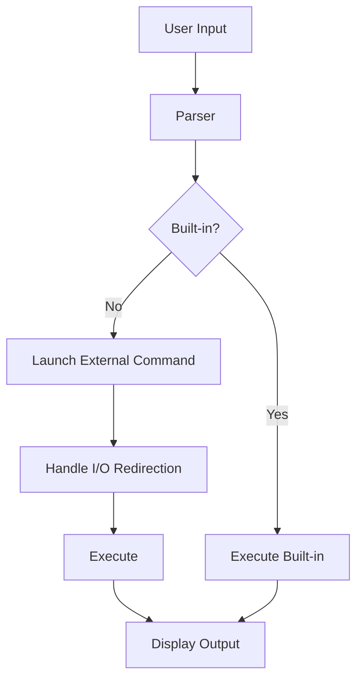

#  MiniShell

<p align="center">
  
</p>

<p align="center">
  <b>A lightweight UNIX-style shell implementation in C</b><br/>
  <i>Supports command execution, I/O redirection, piping, history, and more!</i>
</p>

<p align="center">
  
  
  
</p>

---

## 📑 Table of Contents

- [Features](#features)
- [Screenshots](#screenshots)
- [Architecture](#architecture)
- [Requirements](#requirements)
- [Building](#building)
- [Usage](#usage)
- [Examples](#examples)
- [Cleanup](#cleanup)
- [License](#license)

---

## ✨ Features

| Feature              | Description                                          |
| -------------------- | ---------------------------------------------------- |
| Command Execution    | Run both built-in and external commands              |
| I/O Redirection      | Supports `>`, `>>`, `<` for output/input redirection |
| Command History      | Recall and reuse previous commands                   |
| Background Execution | Run processes in the background using `&`            |
| Signal Handling      | Handles `SIGINT` (Ctrl+C), `SIGTSTP` (Ctrl+Z)        |
| Built-in Commands    | `cd`, `exit`, `pwd`, `echo`, `history`               |

---

## 🖼️ Screenshots

> **Tip:** Replace the below placeholders with your own screenshots for a more personalized README!

| Shell Prompt Example                                                  | Command History Example                                             |
| --------------------------------------------------------------------- | ------------------------------------------------------------------- |
|  |  |

---

## 🏗️ Architecture



---

## ⚙️ Requirements

- GCC compiler
- GNU Readline library
- Make

---

## 🛠️ Building

Clone the repository and build the project:

```bash
git clone <repo-url>
cd minishell
make
```

This will create a `minishell` executable in the project directory.

---

## 🚀 Usage

Run the shell:

```bash
./minishell
```

- The shell displays a prompt with the current working directory.
- Enter commands as you would in a standard UNIX shell.

---

## 💡 Examples

```bash
# List files
ls -l

# Change directory
cd /path/to/directory

# Output redirection
ls -l > output.txt

# Input redirection
cat < input.txt

# Background process
sleep 10 &

# Command history
history
```

---

## 🧹 Cleanup

To remove build artifacts:

```bash
make clean
```

---

## 📄 License

This project is open source and available under the MIT License.

---

> **Note:** For more details, see the source code and comments within each file.
