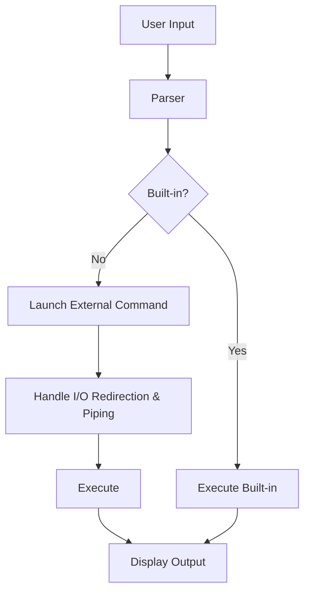

<div align="center">
  
</div>

<h1 align="center">MiniShell</h1>

<p align="center">
  <b>A lightweight UNIX-style shell implementation in C</b><br/>
  <i>Supports command execution, I/O redirection, piping, history, and more!</i>
</p>

<p align="center">
  
  
  
</p>

---

## 📑 Table of Contents

- [Features](#features)
- [Screenshots](#screenshots)
- [Architecture](#architecture)
- [Implementation Details](#implementation-details)
- [Important Code Snippets](#important-code-snippets)
- [Requirements](#requirements)
- [Building](#building)
- [Usage](#usage)
- [Examples](#examples)
- [Cleanup](#cleanup)
- [License](#license)

---

## ✨ Features

| Feature              | Description                                                      |
| -------------------- | ---------------------------------------------------------------- |
| Command Execution    | Run both built-in and external commands                          |
| I/O Redirection      | Supports `>`, `>>`, `<` for output/input redirection             |
| Command History      | Recall and reuse previous commands                               |
| Background Execution | Run processes in the background using `&`                        |
| Signal Handling      | Handles `SIGINT` (Ctrl+C), `SIGTSTP` (Ctrl+Z)                    |
| Built-in Commands    | `cd`, `exit`, `pwd`, `echo`, `history`, `export`, `unset`, `env` |

---

## 🖼️ Screenshots

> **Tip:** Replace the below placeholders with your own screenshots for a more personalized README!

| Shell Prompt Example                                                  | Command History Example                                             |
| --------------------------------------------------------------------- | ------------------------------------------------------------------- |
|  |  |

---

## 🏗️ Architecture



---

## 🧩 Implementation Details

### Main Shell Loop

The shell's main loop is responsible for reading user input, parsing it, executing commands, and handling cleanup. It also manages signals and history.

#### **Snippet: Main Loop**

```c
int main(int argc, char *argv[]) {
    init_shell();
    while (running) {
        line = get_input_line(PROMPT);
        if (!line) break;
        ast = parse_command(line);
        if (ast) {
            status = execute_pipeline(ast);
            free_command(ast);
        }
        free(line);
    }
    cleanup_shell();
    return status;
}
```

_This loop keeps the shell interactive, handling each command line until the user exits._

### Command Parsing

Parsing is handled by tokenizing the input, expanding environment variables, and building a command structure (AST) that supports pipelines and redirections.

#### **Snippet: Parsing Logic**

```c
CommandNode *parse_command(const char *line) {
    int token_count;
    Token *tokens = tokenize(line, &token_count);
    // ... build CommandNode linked list for each command in pipeline ...
    return head;
}
```

_This function turns a command line into a structured representation for execution._

### Command Execution

Handles both built-in and external commands, manages I/O redirection, and supports pipelines.

#### **Snippet: Executing a Pipeline**

```c
int execute_pipeline(CommandNode *pipeline) {
    if (!pipeline->next) {
        return execute_command(pipeline->args);
    }
    // ... set up pipes, fork processes, connect input/output ...
}
```

_Executes single or multiple commands connected by pipes._

### Built-in Commands

Built-ins are handled internally without spawning new processes (except for `exit`, which terminates the shell).

#### **Snippet: Built-in Dispatch**

```c
static int execute_builtin(char **args) {
    if (strcmp(args[0], "cd") == 0) return execute_cd(args);
    // ... other built-ins ...
}
```

_Dispatches to the correct built-in function based on the command name._

### I/O Redirection & Piping

Redirections are handled by opening files and duplicating file descriptors. Piping is managed by creating pipes and forking processes.

#### **Snippet: Redirection Handling**

```c
static int handle_redirection(char **args, int *in_fd, int *out_fd) {
    for (int i = 0; args[i]; i++) {
        if (strcmp(args[i], ">") == 0) {
            *out_fd = open(args[i+1], O_WRONLY | O_CREAT | O_TRUNC, 0644);
            // ...
        }
        // ... handle < and >> ...
    }
    return 0;
}
```

_Redirects input/output as specified by the user._

### Command History

Command history is managed using GNU Readline, and is saved to `.minishell_history` in the user's home directory.

#### **Snippet: Adding to History**

```c
void add_to_history(LineEditor *editor, const char *line) {
    add_history(line);
    editor->history_count++;
}
```

_Each command entered is added to the history for recall._

### Signal Handling

Handles signals like `SIGINT` (Ctrl+C) and `SIGTSTP` (Ctrl+Z) to ensure the shell remains responsive and cleans up background processes.

#### **Snippet: Signal Handler**

```c
void handle_signal(int sig) {
    if (sig == SIGINT) {
        printf("\n");
        rl_on_new_line();
        rl_replace_line("", 0);
        rl_redisplay();
    }
}
```

_Ensures the shell prompt is redrawn after an interrupt._

---

## ⚙️ Requirements

- GCC compiler
- GNU Readline library
- Make

---

## 🛠️ Building

Clone the repository and build the project:

```bash
git clone <repo-url>
cd minishell
make
```

This will create a `minishell` executable in the project directory.

---

## 🚀 Usage

Run the shell:

```bash
./minishell
```

- The shell displays a prompt with the current working directory.
- Enter commands as you would in a standard UNIX shell.

---

## 💡 Examples

```bash
# List files
ls -l
# Change directory
cd /path/to/directory
# Output redirection
ls -l > output.txt
# Input redirection
cat < input.txt
# Background process
sleep 10 &
# Command history
history
```

---

## 🧹 Cleanup

To remove build artifacts:

```bash
make clean
```

---

## 📄 License

## This project is open source and available under the MIT License.

> **Note:** For more details, see the source code and comments within each file.
